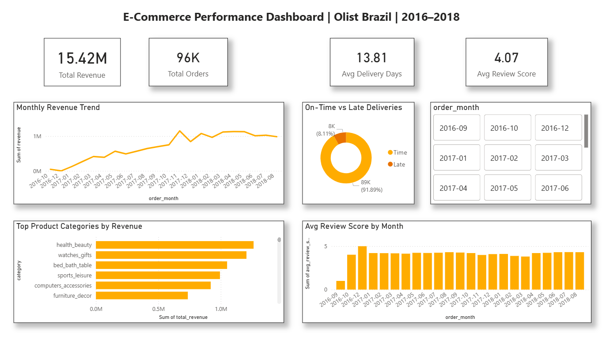
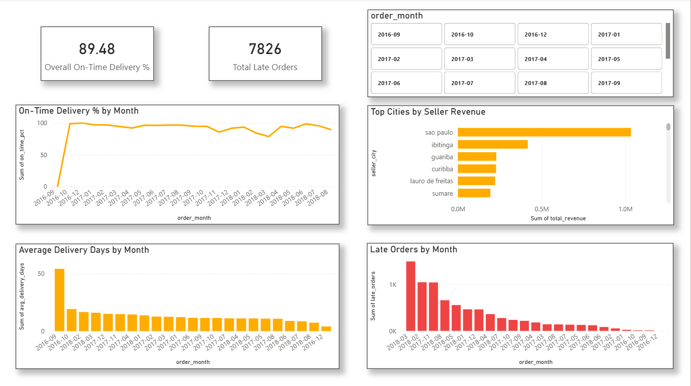
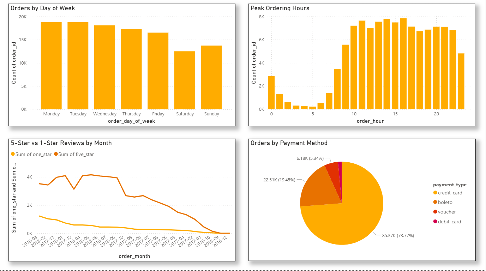

# 🛒 E-Commerce Performance Analytics Dashboard

> End-to-end data analytics project using SQL, Python, and Power BI
> to analyze 100,000+ real e-commerce orders with AI-generated insights.

---

## 📌 Project Overview

This project analyzes the **Olist Brazil E-Commerce Dataset** — 
100,000 real orders from 2016 to 2018 across multiple marketplaces.
The goal is to extract actionable business insights across revenue,
delivery performance, customer satisfaction, and seller behavior
through a fully interactive Power BI dashboard.

---

## 🎯 Business Questions Answered

- Which product categories generate the most revenue?
- What is the on-time delivery rate and where does it fail?
- When do customers order most — by day and hour?
- Which sellers and cities drive the most sales?
- What does customer satisfaction data reveal about the business?
- What are the top strategic recommendations for growth?

---

## 🛠️ Tools & Technologies

| Tool | Purpose |
|------|---------|
| Python (Pandas, Matplotlib, Seaborn) | Data cleaning, EDA, chart generation |
| SQLite + SQL | Database creation, complex queries, joins |
| Power BI | Interactive 3-page dashboard |
| GitHub | Version control and portfolio showcase |

---

## 📁 Project Structure
```
project1_ecommerce/
│
├── 01_load_data.py          # Load CSVs into SQLite database
├── 02_explore_data.py       # Exploratory data analysis
├── 03_clean_data.py         # Data cleaning and enrichment
├── 04_analysis_charts.py    # Generate 6 analysis charts
├── 05_export_for_powerbi.py # Export clean data for Power BI
├── 06_fix_dayofweek.py      # Fix day ordering
├── 07_ai_insights.py        # AI-assisted executive report
│
├── outputs/
│   ├── 01_monthly_revenue_trend.png
│   ├── 02_top_categories_revenue.png
│   ├── 03_orders_by_day.png
│   ├── 04_review_distribution.png
│   ├── 05_delivery_performance.png
│   ├── 06_orders_by_hour.png
│   └── 07_ai_executive_report.txt
│
├── E-Commerce Performance Dashboard.pbix
├── requirements.txt
└── README.md
```

---

## 📊 Dashboard Pages

### Page 1 — Executive Summary
- Total Revenue: R$15.42M
- Total Orders: 96K
- Avg Delivery Days: 13.81
- Avg Review Score: 4.07/5
- Monthly revenue trend (2016–2018)
- Top product categories by revenue

### Page 2 — Delivery & Seller Analysis
- On-time delivery % by month
- Average delivery days trend
- Late orders by month (flagged in red)
- Top seller cities by revenue

### Page 3 — Customer Insights
- Orders by day of week
- Peak ordering hours
- 5-star vs 1-star review trends
- Payment method breakdown

---

## 🔍 Key Insights Discovered

1. **Revenue grew 340%** from September 2016 to peak in November 2017
2. **Health & Beauty** is the #1 revenue category at R$1.25M
3. **91.9% on-time delivery** — but 7,826 orders were late
4. **Monday 4PM** is peak ordering window — prime time for marketing
5. **73.77% of payments** use credit card — critical infrastructure dependency
6. **Sao Paulo** dominates seller revenue across all categories

---

## 💡 Strategic Recommendations

1. Schedule marketing campaigns on **Monday afternoons** for maximum ROI
2. Build a **real-time delivery SLA monitor** to proactively flag late orders
3. Double seller acquisition investment in **top 3 revenue categories**

---

## 🚀 How to Run This Project
```bash
# 1. Clone the repository
git clone https://github.com/Sabarivenkatesh3/ecommerce-analytics-dashboard.git

# 2. Create virtual environment
python -m venv venv
venv\Scripts\activate

# 3. Install dependencies
pip install -r requirements.txt

# 4. Download dataset from Kaggle
# https://www.kaggle.com/datasets/olistbr/brazilian-ecommerce
# Place CSV files in the data/ folder

# 5. Run scripts in order
python 01_load_data.py
python 02_explore_data.py
python 03_clean_data.py
python 04_analysis_charts.py
python 05_export_for_powerbi.py
python 07_ai_insights.py

# 6. Open Power BI dashboard
# Open: E-Commerce Performance Dashboard.pbix
```

---

## 📈 Dashboard Preview

### Page 1 — Executive Summary


### Page 2 — Delivery & Seller Analysis


### Page 3 — Customer Insights


---

## 👤 About

**Sabarivenkatesh Kathirvel**
Aspiring Data Analyst | SQL • Python • Power BI

📧 sabarivarun3@gmail.com
💼 (https://www.linkedin.com/in/sabarivenkatesh-k/)
🐙 https://github.com/Sabarivenkatesh3/

---

*This project was built as part of a portfolio to demonstrate
real-world data analytics skills including SQL, Python,
data cleaning, visualization, and business insight generation.*